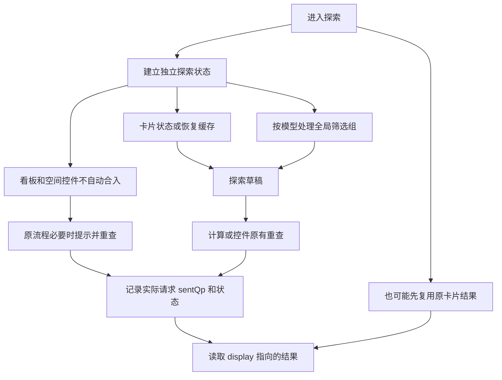

# Exploration query and inheritance

Read [dashboard-context.md](dashboard-context.md) first. Match the active report and session before reading exploration state. Query status has only submitted/running/succeeded/failed/unknown in this source; cancelRequestedAt does not add a canceled status. Current validation may remain unknown even after a successful request.

## 10. 探索继承规则与实际生效范围

- 这是原查询流程的现状说明，不是新增继承开关；Context 只记录，不把看板条件补进探索 QP，也不修改原报表。
- “全局筛选组” globalFilters 与“看板/空间页面控件” dashboardFilter/spaceFilter 是三种不同来源；不能因为它们都在看板顶部就合并推断。
- 进入时继承的初始值、正在编辑的探索草稿、已提交请求和当前展示结果是四件事；开抽屉不证明重查，更不证明所有看板条件均生效。

### 10.1 进入探索时的来源规则

以下状态路径默认相对 temporaryState.explore；reports、temporaryState.surface 是根对象下的路径，外层 dashboardConditions 位于 temporaryState.dashboardConditions。sentQp 须先定位该 session 的实际请求，不是探索根字段。

| 来源 | 原业务行为 | Context 读取与判断边界 |
| --- | --- | --- |
| 报表定义、原事件与指标 | 以 reportData.events/eventView 为查询构造基础；groupBy、人群等初始化自报表定义，commonFilter 等字段随后由探索查询构造覆盖。不是整份已存 QP 不变复制。 | reports[reportKey] 只提供目录信息；参与本次查询的定义以对应 sentQp 为准。 |
| 卡片时间、VS、粒度和展示状态 | 普通打开复制 cardState；因此已作用到卡片的全局时间及局部调整可能进入探索。重新打开恢复时可使用 EXPLORE_STATE，而不是重新复制最新卡片状态。 | entry.source、conditions.draft.timeRange/timeComparison/granularity、viewState；最终解析日期及粒度查 sentQp。 |
| 全局筛选组 globalFilters（非 SQL） | 初始化独立 filters/relation；普通模型复制全局组，reportModel=3（属性）/4（路径）仅保留支持的用户属性：tableType=1，或 tableType=2 且 entityTableDisplayType=1。复合组会过滤不支持项。 | conditions.draft.filters/relation；提交后查 sentQp.eventView.commonFilter.filter。不能假设所有事件属性均被继承。 |
| 看板控件 dashboardFilter | 原探索不支持页面筛选器，不自动合入探索 commonFilter。检测到有值且未禁用的页面筛选时，原流程提示“探索不支持页面筛选”并自动重新查询。 | 外层 dashboardConditions.effective.dashboardFilters 仍保留看板条件，不表示探索查询使用它。 |
| 空间控件 spaceFilter | 与看板控件使用同一排除逻辑；不因所属空间条件仍存在就认定探索继承。自动重查不是用户又点击了计算。 | 外层 dashboardConditions.effective.spaceFilters 与探索请求 sentQp 分开读取。 |
| SQL 报表（reportModel=10） | 从 SQL_SEARCH_CONDITION/动态参数的 QP 走 SQL 分支；合法全局组由 globalFilters/globalRelation 写入 commonFilter，不使用非 SQL 的 filterRef 构造。SQL 参数已有内容以真实请求为准。 | conditions.draft.sqlParams 和 sentQp 分别表示草稿与请求；不能因非 SQL 的 getFilters 规则推断 SQL 最终过滤范围。 |
| 探索内编辑、历史/收藏、退出 | 编辑保存在独立探索状态；计算或控件原有重查入口才提交。历史/收藏可重新替换探索条件。退出恢复看板模式，不将探索草稿应用到原卡片。 | loadedPreset、conditions、queryState，以及根对象下 temporaryState.surface.type；关闭后 explore 清空，不用旧 lastOperation 宣称仍在探索。 |

### 10.2 如何判断实际生效范围

1. 先匹配 temporaryState.surface.type=explore、temporaryState.surface.reportKey 和探索 sessionId；entry 中的 dashboardConditionVersion/reportConditionVersion 只是入口版本，不是继承条件清单。
2. 问“用户现在编辑什么”：读取 conditions.draft、draftVersion、hasUnappliedChanges；不将 draft 直接描述为当前结果条件。
3. 问“最新发出了什么”：读取 queryState.latestRequestId 对应 queries[requestId].sentQp、requestOptions、status/evidence。sentQp 是实际 body.qp（通常是 JSON 字符串），不是前端再次拼装；未记录的请求不能补造。
4. 问“屏幕结果用什么”：先读 queryState.display。origin=report_card 表示复用卡片结果，此时展示可能仍来自带页面控件筛选的卡片；不能套用尚未完成的探索查询。
5. 当前探索新请求提交后会清空展示并设置 display.origin=none、state=loading，只保留该次请求记录，不维护历史 QP 池。成功返回后才指向 explore 结果；不要假定等待期间仍显示旧卡片结果，也不要从 queries 中寻找已被替换的历史请求。
6. display.origin=explore 时按 display.requestId 定位查询；不能用 latestRequestId 或最新草稿覆盖它。origin=none 或缺少所需请求事实时说明暂无可确认的展示查询。
7. 只有对应请求的实际 sentQp 能说明该次提交携带哪些条件；提交不等于成功。看板控件值仍在外层 Context 中，不是把它们附加到探索 sentQp 的依据。



示例：看板有 country=中国、accountbalance>100 控件，全局组为 channel=官网 OR 账户ID有值。进入普通事件报表探索后，原流程可保留全局组与卡片时间，但不自动继承上述两个页面控件。应按探索实际 sentQp 说明这些条件未参与该次探索提交，而不是说 MCP 漏传，也不能宣称看板控件已被用户清空。

## Source type excerpts

These are selected original declarations, not a new unified payload or a standalone schema. Referenced types are explained in the corresponding business reference.

```typescript
export type ExploreTicket = {
  sessionId: string;
  reportKey: string;
  draftVersion: number | null;
  draftFingerprint: string | null;
  operationId: string | null;
  trigger: 'calculate' | 'refresh' | 'control_change' | 'history' | 'favorite' | 'automatic';
};
export type ExploreQuery = Omit<ExploreTicket, 'sessionId' | 'reportKey'> & {
  requestId: string;
  sentQp: Json;
  requestOptions: Record<string, Json>;
  status: 'submitted' | 'running' | 'succeeded' | 'failed' | 'unknown';
  evidence: string;
  observedAt: number;
  cancelRequestedAt: number | null;
};
export type ExploreState = {
  sessionId: string;
  entry: {
    source: 'card' | 'restored';
    dashboardConditionVersion: number;
    reportConditionVersion: number;
  };
  ui: Record<string, Json>;
  conditions: {
    draft: Record<string, Json>;
    draftVersion: number;
    submittedDraftVersion: number | null;
    validation: 'valid' | 'invalid' | 'unknown';
    hasUnappliedChanges: boolean | null;
  };
  viewState: Record<string, Json>;
  loadedPreset: { type: 'history' | 'favorite'; key: string | null } | null;
  queryState: {
    latestRequestId: string | null;
    queries: Record<string, ExploreQuery>;
    display: {
      origin: 'report_card' | 'explore' | 'none';
      requestId: string | null;
      state: string;
    };
  };
};
```
